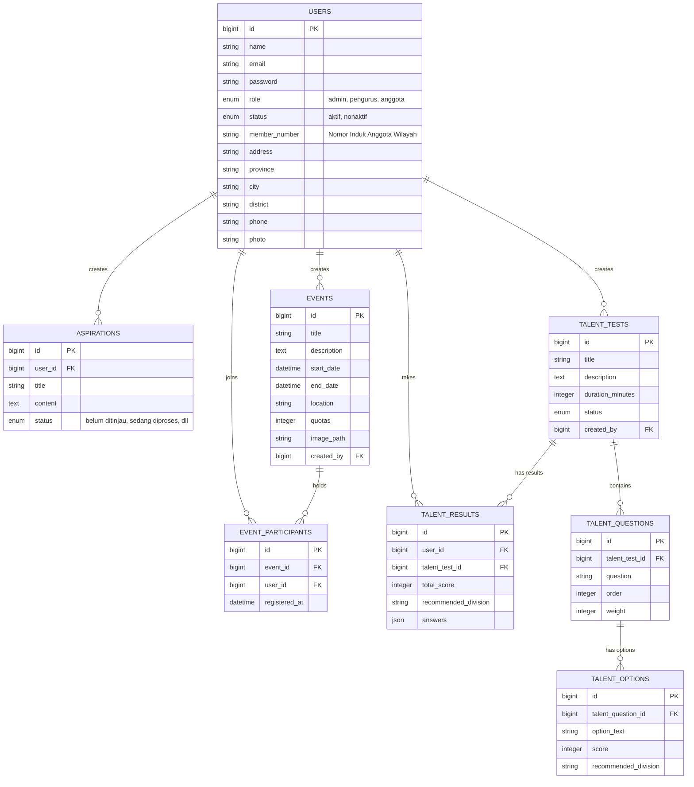

# Organisasi Management System (Karang Taruna)


Organisasi Management System (OMS) adalah aplikasi komprehensif yang dirancang secara spesifik, responsif, dan elegan untuk mengelola alur kerja organisasi seperti **Karang Taruna**. Sistem ini menangani portal anggota, rekrutmen/verifikasi pendaftaran, penerbitan Kartu Tanda Anggota (KTA) digital berbentuk tiket interaktif dan dokumen cetak (PDF), penyaluran aspirasi (ticketing), manajemen acara (event), hingga penyediaan modul Tes Minat dan Bakat untuk pemetaan pembagian anggota ke struktur kepanitiaan/divisi.

## 🚀 Fitur Utama
- **Manajemen Anggota:** Registrasi, pembuatan otomatis Nomor Induk Anggota (NIA) berdasarkan region kependudukan, role (Admin/Pengurus/Anggota), dan aktivasi yang dilengkapi dengan interkoneksi Email Notifikasi menggunakan Brevo API.
- **Dynamic KTA (Kartu Tanda Anggota):** Kartu identitas interaktif di portal yang bisa di-flip dengan animasi 3D, serta mendukung pengunduhan dalam format PDF (Render otomatis melalui server/DomPDF).
- **Manajemen Acara (Event CMS):** Pembuatan, pengaturan *banner*, status *real-time*, dan pencatatan partisipan untuk setiap inisiatif dan program acara.
- **Penampungan Inisiatif/Aspirasi:** Mengadopsi metode *helpdesk ticketing* untuk menampung kritik, usulan acara, dan saran anggota, dengan *tracking* status ("Belum Ditinjau", "Sedang Diproses", dll).
- **Tes Minat & Bakat:** Engine Modul Psikotes mini di mana Admin dapat mengelola bank soal berbentuk *multiple choice* yang langsung menskoring parameter dan memberi keputusan sistem mengenai "Divisi mana pelamar ini paling cocok" (Misal: Humas, Kreatif, Olahraga).

---

## 🛠 Tech Stack

Sistem dibangun terpisah dengan menggunakan arsitektur Decoupled/Headless, dengan tumpukan teknologi mutakhir:

### Frontend
- **Framework:** Next.js 16 (App Router)
- **Library UI / Styling:** React 19, Tailwind CSS v4
- **Modul Ekstensi:** `daftar-wilayah-indonesia` (untuk selektor wilayah pendaftaran), `lucide-react` / Material Symbols (untuk ikonografi yang modern).

### Backend
- **Framework:** Laravel 11
- **Bahasa Permrograman:** PHP 8.2+
- **Database:** MySQL
- **Manajemen Autentikasi:** Laravel Sanctum (Token-Based Authentication)
- **Plugin Inti Tambahan:** `barryvdh/laravel-dompdf` (Pembuatan PDF untuk KTA).
- **Integarsi Third-Party API:** [Brevo API](https://www.brevo.com/) (Transactional SMTP Mailer Service v3).

---

## ⚙️ Persyaratan Sistem (Prerequisite)

Sebelum memulai intalasi, pastikan piranti komputer/server Anda memenuhi syarat berikut:
- **Node.js** V20.0 atau lebih tinggi
- **PHP** V8.2 atau lebih tinggi & **Composer**
- **MySQL Server**
- Sebuah akun **Brevo** untuk pengiriman Email aktivasi otomatis.

---

## 💻 Panduan Instalasi (Development Mode)

Aplikasi ini dipisahkan menjadi dua pilar: `backend/laravel` dan `frontend`. Keduanya harus dikonfigurasi secara mandiri.

### 1. Konfigurasi Backend (Laravel)

Buka terminal dan navigasikan ke map root backend:
```bash
cd backend/laravel
```

Instal dependensi Composer:
```bash
composer install
```

Siapkan environment file:
```bash
cp .env.example .env
php artisan key:generate
```

Ubah pengaturan di dalam berkas `.env` Anda sesuai kredensial server. Termasuk detail Database MySQL dan Brevo Credentials:
```env
# URL Frontend untuk policy CORS agar API dapat dikonsumsi
FRONTEND_URL=http://localhost:3000

# Konfigurasi Database
DB_CONNECTION=mysql
DB_HOST=127.0.0.1
DB_PORT=3306
DB_DATABASE=organisasi_management_system
DB_USERNAME=root
DB_PASSWORD=secret

# Integrasi Brevo untuk notifikasi pendaftaran
BREVO_APIKEY=kuncirahasia_anda...
BREVO_EMAIL=email_admin_anda@example.com
```

Lakukan migrasi skema database beserta Dummy/Seeder Data bawaan (Opsional):
```bash
php artisan migrate --seed
```

Bisa ditambahkan dengan me-link *storage* agar akses penyimpanan (seperti gambar avatar poster) bisa terlihat di level antarmuka:
```bash
php artisan storage:link
```

Jalankan Development Server:
```bash
php artisan serve
```
*(Server backend akan berjalan di `http://127.0.0.1:8000`)*.

---

### 2. Konfigurasi Frontend (Next.js)

Buka sesi terminal **terpisah**, mulai dari map root pindah ke letak client web:
```bash
cd frontend
```

Instal seluruh paket manajer modul:
```bash
npm install
# Atau menggunakan yarn/pnpm:
# yarn install
```

Pastikan Anda menyambungkan target Endpoint API (Secara default `lib/api.ts` sudah menyasar ke `:8000/api`).

Jalankan Development Server Next.js:
```bash
npm run dev
```

Akses aplikasi di browser pada bilah: **`http://localhost:3000`**

---

## 📊 Entity Relationship Diagram (ERD)

Struktur Data untuk Organisasi Management System dirajut melalui skema relasional yang dinamis. Berikut adalah representasinya:



---

## 🧑‍💻 Arsitektur & Pedoman Developer
- Seluruh modul administrasi berada di grup rute Next.js **`(admin)/admin`**.
- Hak akses (RBAC) ditegakkan menggunakan implementasi perlindungan Next.js Middleware *(soft barrier)* dengan revalidasi ketat di Laravel *(hard barrier)*.
- Pengaturan desain menggunakan sintaks primitif CSS Native (`global.css`) yang dicampur dengan utilitas Tailwind generasi terbaru di dalam Next.js.
- Berkas penunjang dan SDK kustom dapat ditemukan di direktori `frontend/lib/api.ts`.

---


